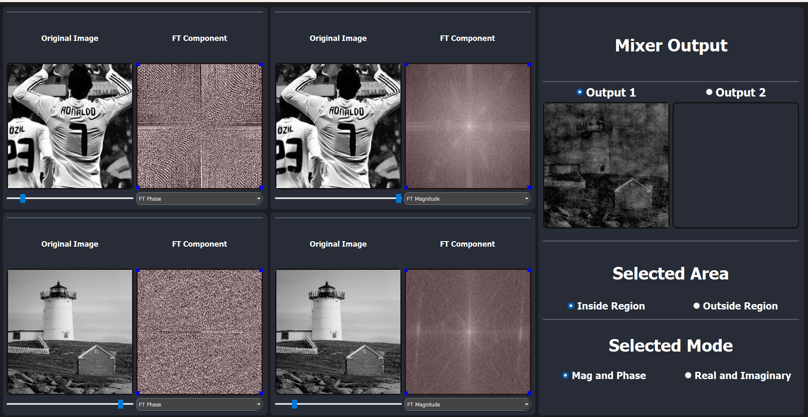
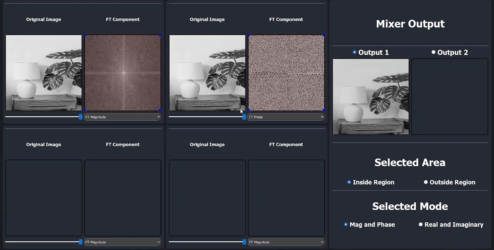

# FT Image Mixer



## Description

- Desktop Application Designed For Analyzing The Importance Of Fourier Transform Components
- User-Friendly Interface Allowing Simple Mixing Of Multiple Images
- Provides A Simulation Environment For Visualizing & Customizing 2D Beamforming Patterns

## Tech Stack Used

|**Functionality** | |
|--- | --- |
|**UI** | |
|**Styling** | [](#)|

## Features
### 1. Image Browsing
- Browse Any Image By Double Clicking On The Input Widget


### 2. Manipulation Of Image's FT Components
- Change Its Magnitude And Phase Components


&nbsp;
- Change Its Real And Imaginary Components


### 3. Selected Region
- Dynamically Resize The Selected Area Of FT Component
   

&nbsp;
- Real Time Toggling Between Inner Region & Outer Region Of The Selected Area
   

### 4. Mixing Multiple Images
- Combine Multiple Images Using Customizable Weights For Each Component
   

### 5. Beamforming
- 5G Mode Showcasing Beam Pattern Analysis & Interference Pattern
   

&nbsp;
- Changing Properties For Each Array Unit


&nbsp;
- Tumor Ablation Scenario Where The Ultrasound Is Focused On A Target Point


## Installation

1. Make Sure That Pip & Python Are Installed On Your System

2. Clone The Repo Onto Your Local System or Download The Zip File & Extract It
   ```bash
    git clone https://github.com/mostafa-aboelmagd/ft-image-mixer.git
    ```

3. Nagivate To The Project's Directory 
   
4. Install The Required Libraries
    ```bash
    pip install -r requirements.txt
    ```

5. Run `main.py` File
    ```bash
    python main.py
    ```

## Contributors

| Name | GitHub | LinkedIn |
| ---- | ------ | -------- |
| Mostafa Ayman | [](https://github.com/mostafa-aboelmagd) | [](https://www.linkedin.com/in/mostafa--aboelmagd/) |
| Ali Zayan | [](https://github.com/alizayan684) | [](https://www.linkedin.com/in/%D8%B9%D9%84%D9%8A-%D8%B2%D9%8A%D8%A7%D9%86-%F0%9F%94%BB%F0%9F%87%B5%F0%9F%87%B8-b98239264/) |
| Zeyad Amr | [](https://github.com/Zisco2002)| [](https://www.linkedin.com/in/zeyad-amr-3506b225b/) |
| Mostafa Mousa | [](https://github.com/MostafaMousaaa) | [](https://www.linkedin.com/in/mostafa-mousa-b81b8322a/) |
| Omar Khaled | [](#)| [](https://www.linkedin.com/in/omar-khaled-064b7930a/) |
